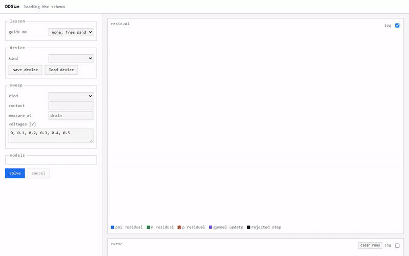

# DDSim

[](https://github.com/yaasshh09/DDSim/actions/workflows/ci.yml)

I built a semiconductor device simulator from scratch. You give it a device's
shape and doping, and it solves the drift-diffusion equations to get the I-V
and C-V curves. Nothing is fitted along the way.

**Try it in the browser: [ddsim.fly.dev](https://ddsim.fly.dev)**


## At a glance

| | |
|---|---|
| What it solves | Poisson's equation plus electron and hole continuity (the Van Roosbroeck system), in 1D and 2D |
| Devices | PN diode, MOS capacitor, NMOS transistor, and any 2D device you draw |
| Numerics | Scharfetter-Gummel discretization, full Newton on the coupled system, bias continuation, exact small-signal C-V |
| Physics models | SRH and Auger recombination, Arora, Lombardi and Caughey-Thomas mobility, Fermi-Dirac statistics |
| Checked against | Closed-form textbook limits, plus DEVSIM 2.11 on 10 benchmarks |
| Tests | 2,680 |
| Built with | Python, NumPy, SciPy sparse. FastAPI and plain JavaScript for the web app, with no build step |

## The main result: short-channel effects that nobody put in

The goal I set for this project: sweep a MOSFET's gate length from 1 um down to
50 nm and have threshold roll-off, DIBL and velocity saturation show up from
the physics alone. If any of them had been hardcoded or fitted, the project
would have failed.

All five devices come from one fixed process (2 nm oxide, 1e18 channel). Gate
length is the only thing that changes.


| Gate length | Threshold at 50 mV | Threshold at 1 V | Subthreshold slope | DIBL | Saturation exponent |
|---|---|---|---|---|---|
| 1 um | 0.2773 V | 0.2693 V | 72.6 mV/dec | 8.5 mV/V | 1.85 |
| 200 nm | 0.2622 V | 0.2496 V | 73.4 mV/dec | 13.2 mV/V | 1.64 |
| 100 nm | 0.2290 V | 0.1999 V | 74.4 mV/dec | 30.7 mV/V | 1.40 |
| 70 nm | 0.1805 V | 0.1212 V | 78.3 mV/dec | 62.5 mV/V | 1.28 |
| 50 nm | 0.0952 V | -0.0252 V | 87.8 mV/dec | 126.7 mV/V | 1.11 |

- **Threshold roll-off (182 mV).** Near the ends of a short channel, the source
  and drain junctions have already depleted some of the charge the gate would
  otherwise have to. That's a 2D Poisson effect and nothing else.
- **DIBL (8.5 to 127 mV/V).** Raising the drain pulls the source barrier down,
  which matters more the closer the drain gets.
- **Velocity saturation (exponent 1.85 down to 1.11).** A long channel follows
  the square law. Once the channel field passes the critical field, the carrier
  velocity stops rising and the exponent drops toward 1. I checked this directly:
  switching off field-dependent mobility changes the 50 nm current by 40
  percent and the 1 um current by under 1 percent.
- **The subthreshold slope never beats 59.5 mV/dec**, the thermal limit at
  300 K. A test fails if it does.

The open markers are DEVSIM running the same five devices with the same
models. The two codes share parameter values and nothing else, and they agree
to within 2.67 percent.

## How I know it's right

A drift-diffusion code with a sign error won't crash. It converges cleanly to a
wrong answer that looks believable. So every result gets checked against
something that doesn't depend on my code.

| Check | DDSim | Reference | Error |
|---|---|---|---|
| Diode depletion width at -5 V | 1.2102 um | 1.2157 um (analytic) | 0.45 % |
| Diode saturation current | 1.3322e-10 A/cm^2 | 1.330 to 1.353e-10 (analytic) | 0.1 to 1.6 % |
| MOS flatband voltage | -0.9192182 V | -0.9192182 V (work function difference) | 2.4e-10 V |
| MOS threshold, 1e16 doping | -0.063867 V | -0.063885 V (analytic) | 0.018 mV |
| MOS C-V curve | full sweep | DEVSIM 2.11 | 0.56 % worst point |
| MOSFET roll-off, matched models | 5 gate lengths | DEVSIM 2.11 | 0.06 % |
| Newton Jacobian, all 9 blocks | analytic | complex-step derivative | 3.5e-14 |

| MOS capacitor C-V against DEVSIM | Diode I-V, ideality factor crossover |
|---|---|
|  |  |

Each of these plots is drawn by a test, and that test asserts the claims on
the plot before it draws anything.

A few other things that keep it honest:

- **Scaled and physical units can't mix.** Every array carries its unit and
  scaling state, and adding the wrong two raises an error.
- **Tests come first.** A test written after the code tends to assert whatever
  the code already does.
- **Newton beats Gummel, and I measured by how much.** At 2 V forward bias,
  Gummel iteration takes 466 cycles and Newton takes 4.

## The web app

The browser front end runs the real solver on the server and streams progress
back over a WebSocket, so you watch the residual fall and the curve draw itself
point by point.



| Pick a device to start | Or follow a guided lesson |
|---|---|
|  |  |

| See the current flow and draw a cutline | C-V of a MOS capacitor |
|---|---|
|  |  |

**Every knob, plot and legend has an explainer.** Each one starts with a plain
explanation, then goes into the equations and points to the docs it came from.


**You can draw your own device** out of silicon, oxide, implants and contacts,
then solve it like any other.


The form isn't written by hand. It's generated from the signatures of the
solver functions, so the browser always offers exactly what the code has. The
page never computes a physical quantity itself, and a test enforces that.

## Running it

```bash
python -m venv .venv
.venv/Scripts/pip install -e ".[dev]"
.venv/Scripts/pytest            # the full suite
.venv/Scripts/ddsim serve       # then open http://127.0.0.1:8000
```

Or from Python:

```python
from ddsim.device.pn_diode import pn_diode
from ddsim.extract.iv import iv_sweep

device = pn_diode(Na=1e16, Nd=1e16, length=12e-4, junction=6e-4, n_nodes=201)
curve = iv_sweep(device, "anode", [0.1, 0.2, 0.3, 0.4, 0.5], step=0.05)
for point in curve.points:
    print(f"{point.voltage:.2f} V  {point.current:.4e} A/cm^2")
```

The browser smoke test needs Chromium once: `.venv/Scripts/python -m playwright install chromium`.

## Limits

- **The sweep stops at 50 nm because the model does.** Drift-diffusion assumes
  the local field sets the local velocity. Below about 50 nm, carriers go
  quasi-ballistic, so velocity overshoot can't appear here by construction.
- **No quantum confinement** in the inversion layer, and **no gate tunneling**
  through the 2 nm oxide.
- **The web app is an instrument, not a service.** There's no authentication.
  The public copy runs at most 2 solves at once and stops any solve after 5
  minutes. A 50 nm transistor takes close to a minute, and the page shows
  what it's doing instead of pretending to be instant.
- **The browser shows the solver's answer but can't check it.** The DEVSIM
  regressions in CI are what check it.

## Where it fits

DDSim is layer 2 of a four-layer stack I'm building. Each layer should get its
inputs from the one below it:

| Layer | Project | Solves | Status |
|---|---|---|---|
| 0 | AtomSIM | Schrodinger equation for an isolated atom | done |
| 1 | band module | band structure and effective masses | later |
| 2 | **DDSim** | carrier transport in devices | done except Phase 6 |
| 3 | SPICE | circuits | next |

Phases 0 to 5 and 7 are done. Phase 6 extracts compact models for SPICE, so it
waits until the SPICE project exists.

What comes next is in [phases/ROADMAP.md](phases/ROADMAP.md). DDSim already
agrees with DEVSIM, and my next goal is to beat it on numbers I can measure.
The plan starts with a scoreboard, then adds AC and noise, transient, error
estimates, the bipolar transistor, breakdown, unstructured and 3D meshes,
quantum correction and other materials.

## Going deeper

| File | What's in it |
|---|---|
| [docs/01-physics.md](docs/01-physics.md) | The equations and every approximation |
| [docs/02-numerics.md](docs/02-numerics.md) | Scharfetter-Gummel, Newton, scaling, continuation |
| [docs/04-validation.md](docs/04-validation.md) | Every analytic test case and DEVSIM benchmark |
| [docs/07-decisions.md](docs/07-decisions.md) | Every decision that changes a result, and every known deviation from a reference |
| [phases/](phases/) | Scope and acceptance criteria for each phase |
| [phases/ROADMAP.md](phases/ROADMAP.md) | Phases 8 to 18, and what beating DEVSIM means in numbers |

```
ddsim/core/        constants, scaling, the Field type
ddsim/mesh/        1D and 2D meshes
ddsim/physics/     Bernoulli, carrier statistics, recombination, mobility
ddsim/discretize/  residual and Jacobian assembly
ddsim/solve/       Newton, Gummel, continuation
ddsim/device/      geometry and doping in, a Device out
ddsim/extract/     terminal currents, I-V, C-V, threshold and roll-off
ddsim/api/         the web server and the browser page
```

## License

CC BY-NC 4.0. You're free to use, share and adapt it for non-commercial work as
long as you credit me. See [LICENSE](LICENSE).
