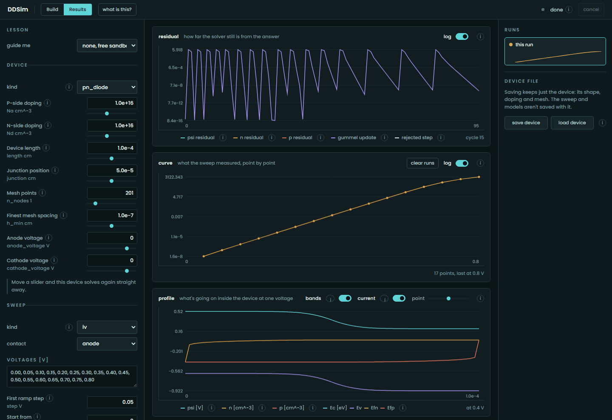
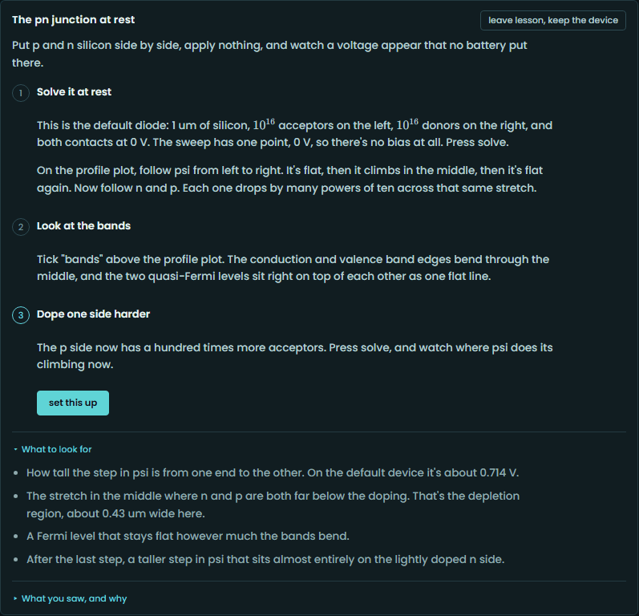
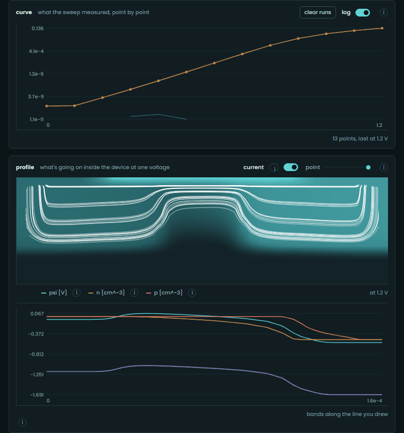
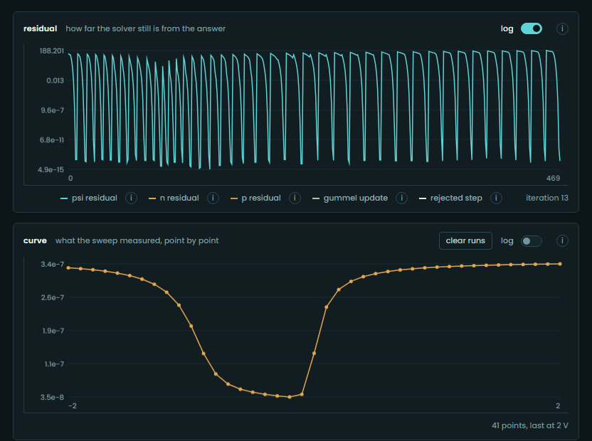
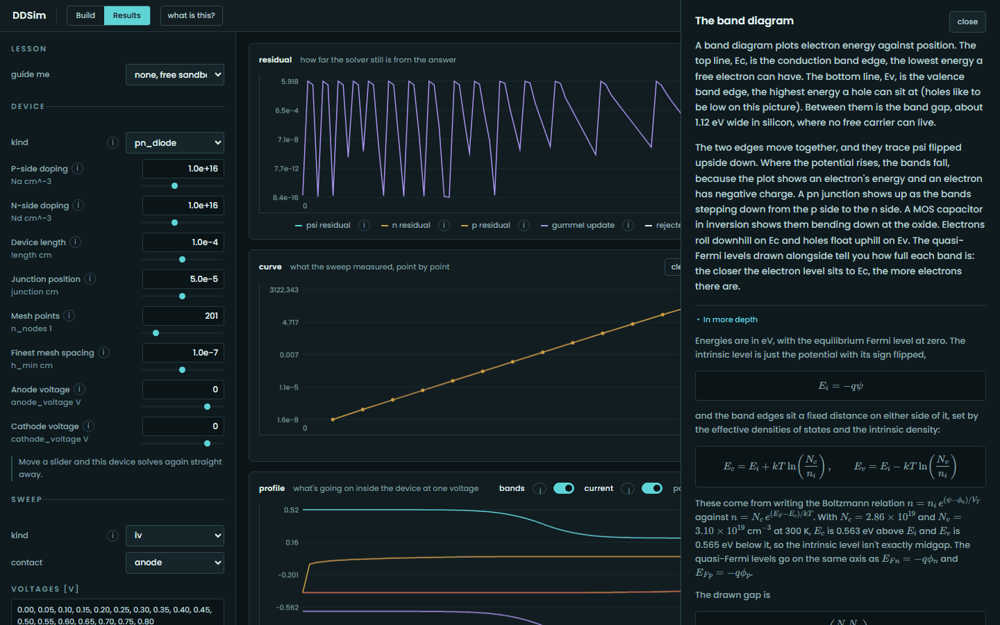
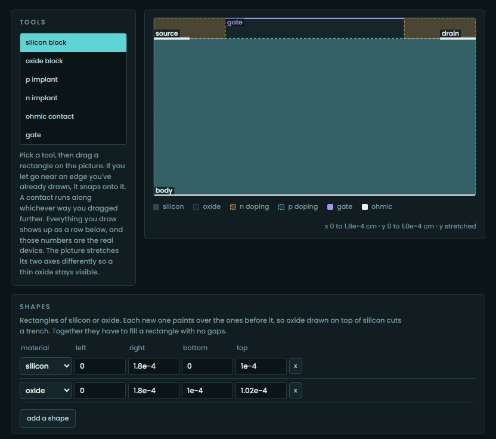

# DDSim

[](https://github.com/yaasshh09/DDSim/actions/workflows/ci.yml)

I built a semiconductor device simulator from scratch. You give it a device's
shape and doping, and it solves the drift-diffusion equations to get the I-V
and C-V curves.

**Try it in the browser: [ddsim.fly.dev](https://ddsim.fly.dev)**

<p align="center">
  
</p>

## What it does

| | |
|---|---|
| What it solves | Poisson's equation plus electron and hole continuity (the Van Roosbroeck system), in 1D and 2D |
| Devices | PN diode, MOS capacitor, NMOS transistor, and any 2D device you draw |
| Numerics | Scharfetter-Gummel discretization, full Newton on the coupled system, bias continuation, exact small-signal C-V |
| Physics models | SRH and Auger recombination, Arora, Lombardi and Caughey-Thomas mobility, Fermi-Dirac statistics |
| Checked against | Closed-form textbook limits, plus DEVSIM 2.11 on 10 benchmarks |
| Tests | 2,680 |
| Built with | Python, NumPy, SciPy sparse. FastAPI and plain JavaScript for the web app, with no build step |

<p align="center">
  
</p>

| Gate length | Threshold at 50 mV | Threshold at 1 V | Subthreshold slope | DIBL | Saturation exponent |
|---|---|---|---|---|---|
| 1 um | 0.2773 V | 0.2693 V | 72.6 mV/dec | 8.5 mV/V | 1.85 |
| 200 nm | 0.2622 V | 0.2496 V | 73.4 mV/dec | 13.2 mV/V | 1.64 |
| 100 nm | 0.2290 V | 0.1999 V | 74.4 mV/dec | 30.7 mV/V | 1.40 |
| 70 nm | 0.1805 V | 0.1212 V | 78.3 mV/dec | 62.5 mV/V | 1.28 |
| 50 nm | 0.0952 V | -0.0252 V | 87.8 mV/dec | 126.7 mV/V | 1.11 |

- The threshold rolls off by 182 mV. Near the ends of a short channel, the
  source and drain junctions have already depleted some of the charge the gate
  would otherwise have to. That's a 2D Poisson effect and nothing else.
- DIBL goes from 8.5 to 127 mV/V. Raising the drain pulls the source barrier
  down, and that matters more the closer the drain gets.
- The saturation exponent drops from 1.85 to 1.11. A long channel follows the
  square law. Once the channel field passes the critical field, the carriers
  stop speeding up and the exponent heads toward 1. I checked this directly:
  turning off field-dependent mobility changes the 50 nm current by 40 percent
  and the 1 um current by under 1 percent.
- The subthreshold slope never goes below 59.5 mV/dec, the thermal limit at
  300 K. I have a test that fails if it does.

The open markers are DEVSIM running the same five devices with the same
models. The two codes share parameter values and nothing else, and they agree
to within 2.67 percent.

## How I know it's right

A drift-diffusion code with a sign error won't crash. It converges cleanly to a
wrong answer that looks believable. So I check every result against something
that doesn't depend on my code.

| Check | DDSim | Reference | Error |
|---|---|---|---|
| Diode depletion width at -5 V | 1.2102 um | 1.2157 um (analytic) | 0.45 % |
| Diode saturation current | 1.3322e-10 A/cm^2 | 1.330 to 1.353e-10 (analytic) | 0.1 to 1.6 % |
| MOS flatband voltage | -0.9192182 V | -0.9192182 V (work function difference) | 2.4e-10 V |
| MOS threshold, 1e16 doping | -0.063867 V | -0.063885 V (analytic) | 0.018 mV |
| MOS C-V curve | full sweep | DEVSIM 2.11 | 0.56 % worst point |
| MOSFET roll-off, matched models | 5 gate lengths | DEVSIM 2.11 | 0.06 % |
| Newton Jacobian, all 9 blocks | analytic | complex-step derivative | 3.5e-14 |

<p align="center">
  
  
</p>

On the left is the MOS capacitor C-V against DEVSIM, and on the right is the
diode I-V with its ideality factor crossover. A test draws each of these
plots, and it checks the claims on the plot before it draws anything.

## The web app

The browser front end runs the real solver on the server and streams progress
back over a WebSocket, so you watch the residual fall and the curve draw itself
point by point.

You can pick one of four starting devices, or follow a guided lesson.

<p align="center">
  
  
</p>

You can see where the current flows and draw a cutline through the device, or
sweep a MOS capacitor's C-V.

<p align="center">
  
  
</p>

Every knob, plot and legend has an explainer. Each one starts with a plain
explanation, then goes into the equations and points to the docs it came from.

<p align="center">
  
</p>

You can also draw your own device out of silicon, oxide, implants and
contacts, then solve it like any other.

<p align="center">
  
</p>

I don't write the form by hand. It's generated from the signatures of the
solver functions, so the browser always offers exactly what the code has. The
page never computes a physical quantity itself, and a test enforces that.

## Running it locally

```bash
python -m venv .venv
.venv/Scripts/pip install -e ".[dev]"
.venv/Scripts/pytest            # the full suite
.venv/Scripts/ddsim serve       # then open http://127.0.0.1:8000
```

Or from Python:

```python
from ddsim.device.pn_diode import pn_diode
from ddsim.extract.iv import iv_sweep

device = pn_diode(Na=1e16, Nd=1e16, length=12e-4, junction=6e-4, n_nodes=201)
curve = iv_sweep(device, "anode", [0.1, 0.2, 0.3, 0.4, 0.5], step=0.05)
for point in curve.points:
    print(f"{point.voltage:.2f} V  {point.current:.4e} A/cm^2")
```

The browser smoke test needs Chromium once: `.venv/Scripts/python -m playwright install chromium`.

## License

CC BY-NC 4.0. You're free to use, share and adapt it for non-commercial work as
long as you credit me. See [LICENSE](LICENSE).
