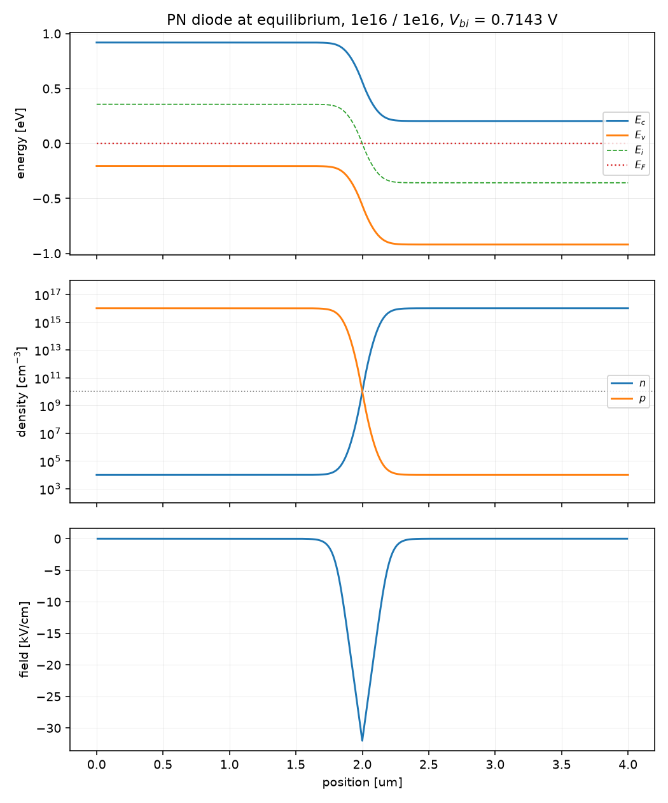
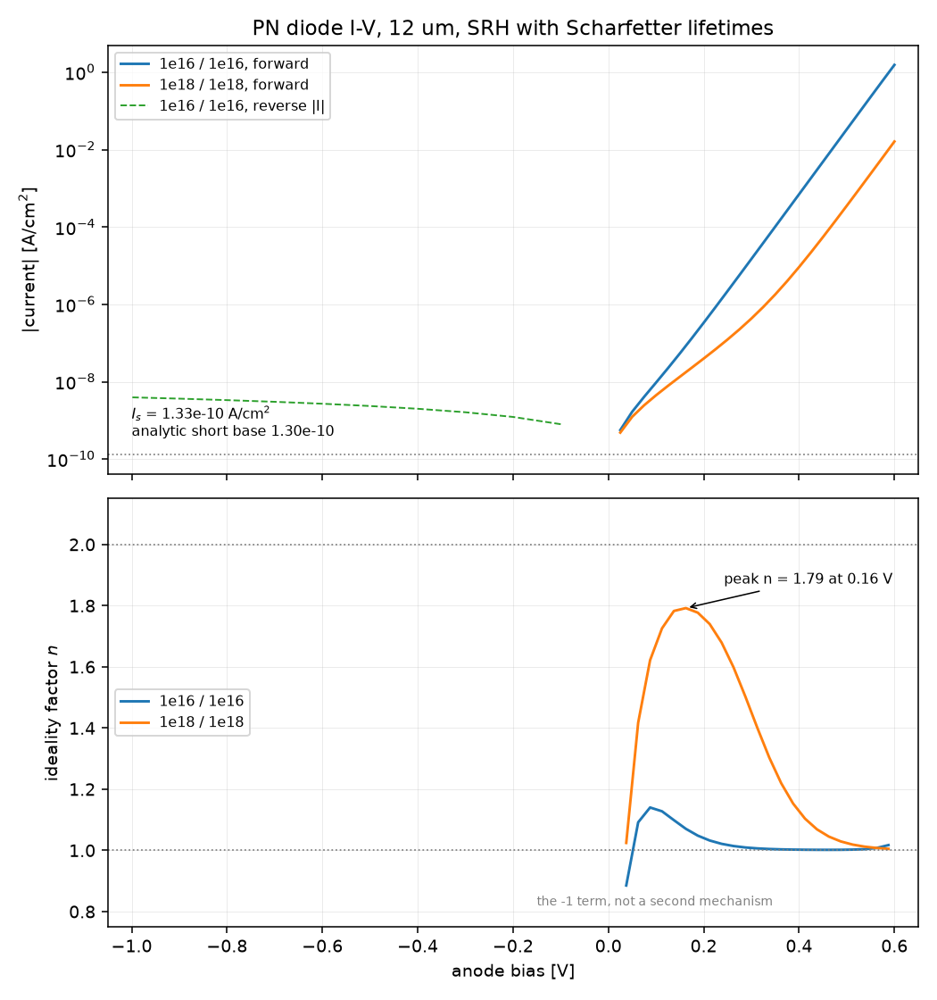
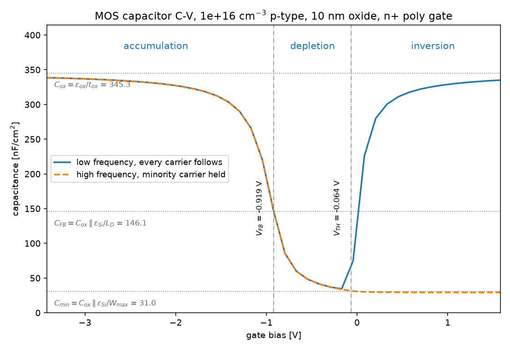
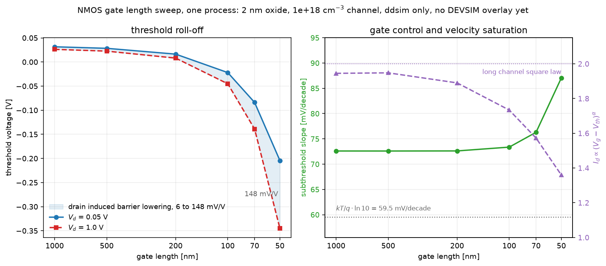

# DDSim

[](https://github.com/yaasshh09/DDSim/actions/workflows/ci.yml)

A drift-diffusion semiconductor device simulator written from scratch. It solves
the Van Roosbroeck system, Poisson plus the electron and hole continuity
equations, self consistently, and produces device I-V and C-V characteristics
from geometry and doping alone.

Layer 2 of a four layer solver stack: AtomSIM solves the isolated atom, a band
module supplies effective masses, DDSim solves carrier transport, and a SPICE
layer solves the circuit. Every material parameter DDSim consumes should
eventually be computed by a layer below it.

## Where it is

Phases 0 to 4 of 7 are done. A PN diode solved two ways, Gummel block
iteration and full Newton on the coupled 3N system, and a two material MOS
capacitor in 2D whose C-V curve comes out of the same solver with nothing
fitted anywhere in it. Transport runs in either dimension, so a 2D diode
conserves current through every cut and keeps doing it with a dielectric
layer stacked on top.

Phase 5 is the MOSFET, and its gate length sweep runs: threshold roll-off,
DIBL and velocity saturation all come out of six devices that differ in one
argument. What is left of the phase is the DEVSIM comparison, benchmarks 6 to
9, which have no golden data yet.

| Phase | Scope | Status |
|---|---|---|
| 0 | Scaling, the Field type, Bernoulli, meshes, linear solver | done |
| 1 | Equilibrium Poisson in 1D, PN diode | done |
| 2 | Scharfetter-Gummel continuity, Gummel iteration, I-V | done |
| 3 | Full Newton, coupled 3N system, Arora mobility, Auger | done |
| 4 | 2D, MOS capacitor, C-V | done |
| 5 | MOSFET, gate length sweep | |
| 6 | Compact model extraction for SPICE | |
| 7 | Browser frontend, live solver telemetry | |

## PN diode at equilibrium

1e16 / 1e16 abrupt junction, 4 um, 801 nodes. Everything below emerges from
solving Poisson with Boltzmann statistics. Nothing is fitted.



The bands bend by exactly the built-in potential, the Fermi level is flat
because this is equilibrium, n and p cross at n_i precisely at the metallurgical
junction, and the field is the triangle the depletion approximation predicts.

Measured against closed form results:

| Quantity | Simulated | Analytic | Error |
|---|---|---|---|
| Built-in potential, 1e16 / 1e16 | 0.71432 V | 0.71432 V | pinned by the contacts |
| Depletion width, 0 V | 0.4248 um | 0.4298 um | 1.17 % |
| Depletion width, -1 V | 0.6574 um | 0.6659 um | 1.27 % |
| Depletion width, -5 V | 1.2102 um | 1.2157 um | 0.45 % |
| Debye decay length into the bulk | fitted | L_D | under 1 % |
| n p / n_i^2 | 1.0 | 1.0 | 3e-16 |

Newton converges in 8 iterations from the charge neutral guess, with a
quadratic tail, at every doping level from 1e14 to 1e20 cm^-3.

## PN diode I-V

12 um device, SRH recombination with Scharfetter doping dependent lifetimes,
constant mobility. The current, the saturation current and the ideality factor
all come out of the solve. Nothing is fitted.



The saturation current is the sharpest number here, because it is set by
minority carrier diffusion into the quasi-neutral regions and therefore tests
the continuity equations, the contact conditions and the lifetimes at once:

| Quantity | Simulated | Analytic | Error |
|---|---|---|---|
| Saturation current, 1e16 / 1e16 | 1.3322e-10 A/cm^2 | 1.330 to 1.353e-10 | 0.1 to 1.6 % |
| Reverse current at -1 V | -3.94e-9 A/cm^2 | between I_s and 9.7e-9 | in bracket |
| Jn + Jp spread across the device, 0.5 V | 3.3e-10 | 0 | gate is 1e-6 |
| Terminal current sum, 0.5 V | 2.0e-12 of the largest | 0 | gate is 1e-8 |

The saturation current deserves its range rather than a single number. The
simulated value is mesh converged: 1.33256e-10 on 101 nodes, 1.33220e-10 on
201, 1.33194e-10 on 801, so it has stopped moving to five significant figures.
The analytic expression is the loose one, because the quasi-neutral width it
needs depends on where the depletion edge is taken, and that moves the answer
by 1.7 percent across the fitting window. Quoting the tightest pairing as the
error would be quoting my choice of depletion edge.

This diode is short based: the hole diffusion length is 55 um against a 6 um
n side, so the coth(W/L) factor in the general expression is worth a factor of
nine and the agreement does not survive dropping it.

**The ideality factor crossover is the result worth looking at.** At 1e16 the
diode is diffusion limited and n = 1 across the whole useful range. Raise the
doping to 1e18 and depletion region recombination takes over at low bias, and
the ideality rises to 1.79 before falling back to 1 as diffusion current
overtakes it again. The only thing that changed is the doping. Nothing in the
code contains a 2, and the peak sits below 2 for a physical reason: the
depletion region narrows under forward bias, so the recombination volume
shrinks and the current rises slightly faster than exp(V/2V_T).

Gummel converges in 4 cycles at 0.3 V, 12 at 0.7 V, 25 at 0.9 V and 60 at
1.1 V, with the per cycle convergence rate climbing from 0.51 to 0.95 as
injection passes the doping. That degradation is expected, is linear
convergence doing what linear convergence does, and is the reason Phase 3
exists.

## Full Newton on the coupled system

The three equations solved simultaneously instead of in a cycle, with the full
3N Jacobian for (psi, n, p) interleaved by node.

The phase brief said the headline result would be converging at 1 V "where
Gummel failed". Gummel does not fail at 1 V. It does not fail at 2 V either.
Measured along 0.05 V continuation steps with a large cycle budget, it
converges every single time and simply costs more and more:

| Bias | Gummel cycles | Newton steps |
|---|---|---|
| 0.1 V | 3 | 5 |
| 0.5 V | 5 | 5 |
| 1.0 V | 46 | 4 |
| 1.5 V | 224 | 4 |
| 2.0 V | 466 | 4 |

Linear convergence degrading without bound, against quadratic convergence that
does not care. By 2 V Gummel costs 116 times more. That is the honest answer to
the question the phase asked, and it is a better one than the question assumed.

Cold from the Poisson guess with no continuation at all, the 1e16 diode takes
4 Newton steps at 0.6 V, 8 at 0.8 V, 9 at 1.0 V and 11 at 1.2 V, with the
residual reaching 1e-16 and no carrier density going negative anywhere.
Continuation from 0 to 1 V takes 6 solves against a budget of 40 and never has
to retry a step.

**Every one of the nine Jacobian blocks is verified against complex step
differentiation**, individually, on three states including one constructed so
that every Bernoulli argument sits exactly on its removable singularity. Worst
disagreement 3.5e-14 against a criterion of 1e-10.

That test is not decoration. Seven deliberate errors were introduced into the
Jacobian to see what would catch them: a copied charge term, a flipped sign, a
swapped Bernoulli factor, a dropped cross term, and so on. The block
verification caught all seven. The convergence tests caught five, and the two
they missed were both about recombination, where a wrong derivative leaves the
residual history identical to three significant figures. A Jacobian error that
does not show up in the convergence rate is not hypothetical.

## MOS capacitor C-V

Two dimensions, two materials, and nothing fitted anywhere.

The figure is benchmark 4 of `docs/04-validation.md`: a 5 nm oxide on 2 um of
1e16 p-type silicon with an n+ poly gate, box integration on a structured mesh
graded to 0.5 nm at the surface.



The open circles are DEVSIM 2.11 solving the same stack, from `data/golden/`.
Both sides are the gate charge put through the same central difference, because
DEVSIM has no exact derivative path here and comparing an exact derivative
against a difference quotient would measure the operator rather than the
physics. Worst disagreement across the sweep: 0.562 percent, against a 2
percent budget. The visible gap near threshold is that difference quotient
cutting the corner of a curve that turns hard there, which is why the number
quoted is not taken off the picture.

Every line drawn on the figure is a closed form with nothing fitted in it, and
each one is asserted in the test that draws it. The table below reports the
same checks on the 10 nm stack, which is where the doping sweep in
`tests/analytic/` lives:

| Quantity | Simulated | Closed form | Error |
|---|---|---|---|
| Flatband voltage | -0.9192182 V | Phi_MS = -0.9192182 V | 2.4e-10 V |
| Threshold voltage, 1e15 | -0.223715 V | -0.223720 V | 0.004 mV |
| Threshold voltage, 1e16 | -0.063867 V | -0.063885 V | 0.018 mV |
| Threshold voltage, 1e17 | 0.336417 V | 0.336288 V | 0.129 mV |
| Flatband capacitance | 146.161 nF/cm^2 | C_ox in series with eps_Si/L_D, 146.145 | 1.1e-4 |
| Accumulation capacitance | 342.485 nF/cm^2 at V_FB - 5 V | C_ox = 345.313 nF/cm^2 | 0.82 %, gate is 1 % |
| High frequency capacitance at V_TH | 31.560 nF/cm^2 | C_ox in series with eps_Si/W_max, 31.023 | 1.7 % |

The phase gates flatband and threshold at 20 mV. They come out three orders
inside that, and the reason is worth stating because it is not luck.

**The depletion approximation is exact at threshold, by cancellation.** It is
several percent wrong on either side: at a quarter of the way to threshold it
undercounts the surface charge by 7.5 percent. At psi_s = 2 phi_F exactly, the
inversion term in the Poisson-Boltzmann charge is (n_i/Na)^2 exp(2 phi_F/V_T),
and 2 phi_F is defined as V_T ln((Na/n_i)^2), so that term is exactly 1. It
cancels the 1 that the Debye tail at the depletion edge subtracts, identically,
at every doping. The textbook threshold expression is the exact answer at the
one point it is evaluated at. Measured, the ratio is 1.000000 at 1e15, 1e16 and
1e17.

Away from that point the solver is checked against the full Poisson-Boltzmann
charge instead, and tracks it to 0.2 percent while the depletion approximation
is 2.4 to 7.5 percent out.

**Flatband is the sharpest single number.** Bias the gate at Phi_MS and the
whole stack sits at one potential, to a spread of 1e-15 in scaled units, with
Newton taking zero steps because the initial guess is already the answer. It
needs the gate work function, the body contact potential and the intrinsic
reference to agree exactly, and those are computed by three pieces of code that
never otherwise meet.

**There is no interface condition anywhere in this project.** Continuity of
normal D across Si/SiO2 is not imposed; it is what the flux balance at an
interface node already says once every edge carries its own permittivity. That
is the main reason box integration was chosen. Materials are mapped onto cells
rather than nodes, because the face a horizontal edge crosses spans half a cell
either side of it, and at the interface those halves are different materials.
Classifying nodes instead moves the effective oxide thickness by half a mesh
cell, which is a percent of t_ox and reads as physics rather than bookkeeping.

**The capacitance is a derivative, not a difference.** Differentiating
F(psi; V) = 0 with respect to the terminal bias gives one linear system on the
DC Jacobian whose solution is dpsi/dV exactly, so there is no step size and no
truncation error. It agrees with a 10 mV central difference to a part in ten
thousand, which is the central difference's own second order error. This is the
omega to zero limit of the small signal system docs/02-numerics.md asks for;
the mass matrix is empty because Boltzmann statistics have already eliminated n
and p as unknowns.

The high frequency curve is the same solve with the minority carrier response
held fixed, which is what a signal faster than minority carrier generation
does. It is the only approximation on the figure and it is the reason the two
curves separate exactly at threshold and nowhere else.

## MOSFET gate length sweep

The headline result of Phase 5, and the thing the whole project was built to
produce. Six NMOS devices, one process, gate lengths from 1 um down to 50 nm.
`L_gate` is the only argument that differs between them: the 2 nm oxide, the
1e18 channel, the 25 nm junctions and the 10 nm of lateral encroachment are the
same in all six, because that is what roll-off means. A process is fixed once
on a wafer and the gate length is the number a designer draws differently.



| Lg | Vth at 0.05 V | Vth at 1.0 V | Vth, extrapolated | SS | DIBL | alpha | peak gm |
|---|---|---|---|---|---|---|---|
| 1 um | 0.0315 V | 0.0262 V | 0.3321 V | 72.6 mV/dec | 5.6 mV/V | 1.945 | 2.57e2 |
| 500 nm | 0.0283 V | 0.0225 V | 0.3162 V | 72.6 mV/dec | 6.1 mV/V | 1.948 | 4.98e2 |
| 200 nm | 0.0163 V | 0.0080 V | 0.2883 V | 72.6 mV/dec | 8.7 mV/V | 1.890 | 1.20e3 |
| 100 nm | -0.0220 V | -0.0452 V | 0.2461 V | 73.4 mV/dec | 24.4 mV/V | 1.733 | 2.37e3 |
| 70 nm | -0.0838 V | -0.1390 V | 0.1985 V | 76.3 mV/dec | 58.1 mV/V | 1.572 | 3.36e3 |
| 50 nm | -0.2043 V | -0.3451 V | 0.1171 V | 87.1 mV/dec | 148.2 mV/V | 1.359 | 4.51e3 |

Currents are per cm of width. Threshold is the constant current method at
Id = 100 nA * W / L, and the extrapolated column is the tangent at peak
transconductance with the -Vd/2 correction. alpha is the power fitted to
Id against gate overdrive in saturation.

### What emerged, and why

**Threshold roll-off, 236 mV between 1 um and 50 nm.** Nothing in the solver
knows what a short channel is. The gate has to deplete the channel charge
underneath it, and near either end of a short channel some of that charge is
already depleted by the source or drain junction, which the gate then gets for
free. That sharing is a two dimensional Poisson solution and nothing else, and
it grows as the two junctions approach each other. The doping did not move
between these six devices.

**DIBL, 5.6 to 148 mV/V.** The gap between the two curves on the left panel.
Raising the drain to 1 V pulls the source barrier down through the channel, so
less gate is needed to turn the device on. At 1 um the drain is too far away to
reach and the residual 5.6 mV/V is what a drain a micron away still does.

**Subthreshold slope off its limit, 72.6 to 87.1 mV/decade.** Every value is
above 59.5, which is kT/q ln 10 at 300 K and which no thermally activated
current can beat. It sits flat while the gate owns the barrier and lifts once
the drain starts sharing control. 72.6 rather than 59.5 at the long end is the
body factor: the gate moves the surface potential by less than the bias applied
to it, because the depletion capacitance divides with the oxide capacitance.

**Velocity saturation, alpha from 1.945 to 1.359.** A long channel MOSFET
saturates as the square of overdrive, because the inversion charge and the
velocity that carries it both rise with the gate. Caughey-Thomas takes the
velocity out of that product once the channel field passes the critical field,
and the exponent falls toward 1. Nothing anywhere contains a 2 or a 1: both
ends are fitted off the solved curves.

The sweep, the process and the extraction all live in `ddsim/extract/rolloff.py`,
and the figure is produced by `tests/analytic/test_mosfet_rolloff_plot.py`,
which asserts every one of these claims before it draws anything.

### What is not on this figure yet

DEVSIM. Benchmarks 6 to 9 of `docs/04-validation.md` are the MOSFETs and they
have no golden data yet, so the plot is ddsim alone and says so. Generating
them is what closes Phase 5.

### Where these numbers stop meaning anything

The sweep stops at 50 nm because that is where the model does, not because the
solver stops converging.

**Drift-diffusion assumes the local field sets the local velocity.** In a 50 nm
channel a carrier crosses in less time than it takes to reach the steady
velocity of the field it is in, so a real device overshoots and this one cannot
by construction. Velocity overshoot is invisible here, and it is the effect
that makes short real transistors faster than this model says.

**Quantum confinement in the inversion layer is not modelled.** The inversion
charge sits in a triangular well a few nanometres wide, its states are
quantised, and the centroid of the charge is pushed away from the interface.
That raises the effective oxide thickness by a few angstroms and shifts the
threshold. Neither appears here.

**The 2 nm oxide leaks and this model does not.** Direct tunnelling through
2 nm of SiO2 is a real gate current at 1 V and there is no gate current in
these equations at all.

None of these are hard to add badly. Extending the sweep to 20 nm and reporting
numbers with all three of them missing would be worth less than stopping here
and saying why.

## Running it

```bash
python -m venv .venv
.venv/Scripts/pip install -e ".[dev]"
.venv/Scripts/pytest
```

```python
from ddsim.device.pn_diode import pn_diode
from ddsim.extract.iv import iv_sweep
from ddsim.extract.params import ideality_factor

device = pn_diode(Na=1e16, Nd=1e16, length=12e-4, junction=6e-4, n_nodes=201)
curve = iv_sweep(device, "anode", [0.1, 0.2, 0.3, 0.4, 0.5], step=0.05)

for point in curve.points:
    print(f"{point.voltage:.2f} V  {point.current:.4e} A/cm^2")

bias, n = ideality_factor(curve.voltage, curve.current)
print(f"ideality {n[-1]:.3f} at {bias[-1]:.2f} V")
```

Each bias point is continued from the one before it, which is the only way a
forward biased solve reaches its answer. There is no such thing as a good
initial guess at 0.5 V.

## How it is kept honest

A drift-diffusion solver with a sign error does not crash. It converges cleanly
to a physically wrong answer that looks entirely plausible. Everything about the
way this repo is built is a response to that.

**Scaled and physical units cannot mix.** Every array carries its unit, its
scaling state and its mesh location, and arithmetic across any of them raises
rather than coercing. A scaled potential of 38.7 and a physical potential of
1.0 V are the same thing, and nothing else would notice them being added.

**Every quantity is tested against an analytic limit**, not against whatever the
code currently produces. The Bernoulli function is checked against an 80 digit
reference, its branch thresholds tuned by measurement rather than taken from the
docs. Jacobians are verified by complex step differentiation, which is exact.

**The invariants are checked, and so are the reasons they fail.** Current
continuity is the strongest single check available: with recombination off, the
total current through every plane of the device has to be identical. It holds
to 3e-10 at 0.5 V and degrades to 1e-2 at zero bias, which looks alarming and
is not a conservation error. Jn is the difference of two edge terms of size
(Dn/h)*n and near equilibrium those cancel to nothing, so what is left is
machine epsilon times the ratio of a flux term to the current. That claim is
measured rather than asserted: the observed spread over the predicted floor
sits between 0.4 and 1.2 across seven decades of bias. An invariant that is
allowed to fail without an explanation is worth nothing, and so is one whose
explanation is never checked.

**Tests are written first.** In a numerics project, a test written after the
code tends to assert whatever the code already does.

Validation runs in four tiers: unit tests against textbook formulas, analytic
device tests against closed form results, invariants that hold for every solve,
and regression against DEVSIM. See `docs/04-validation.md`.

## Layout

    ddsim/core/        constants, de Mari scaling, the Field type
    ddsim/mesh/        1D meshes uniform, graded and stacked; 2D tensor meshes
    ddsim/physics/     pure functions: Bernoulli, carrier statistics, recombination
    ddsim/discretize/  residual and Jacobian assembly, boundary conditions
    ddsim/solve/       Newton, Gummel, continuation, no semiconductor knowledge
    ddsim/device/      composition: geometry and doping in, a Device out
    ddsim/extract/     post processing: terminal current and charge, I-V, C-V
    docs/              physics, numerics, architecture, validation, constants,
                       and the decisions and deviations log
    phases/            scope and acceptance criteria per phase

`docs/07-decisions.md` records every physics decision that affects a result and
every place the code knowingly disagrees with a reference or with one of its own
docs. Tests cite rows in it to justify what they assert.

## Success criterion

Sweep MOSFET gate length from 1 um down to 50 nm and watch threshold voltage
roll-off, DIBL and velocity saturation emerge from the physics with no empirical
fitting. If any short channel effect is hardcoded or fitted, the project has
failed regardless of how good the plots look.
