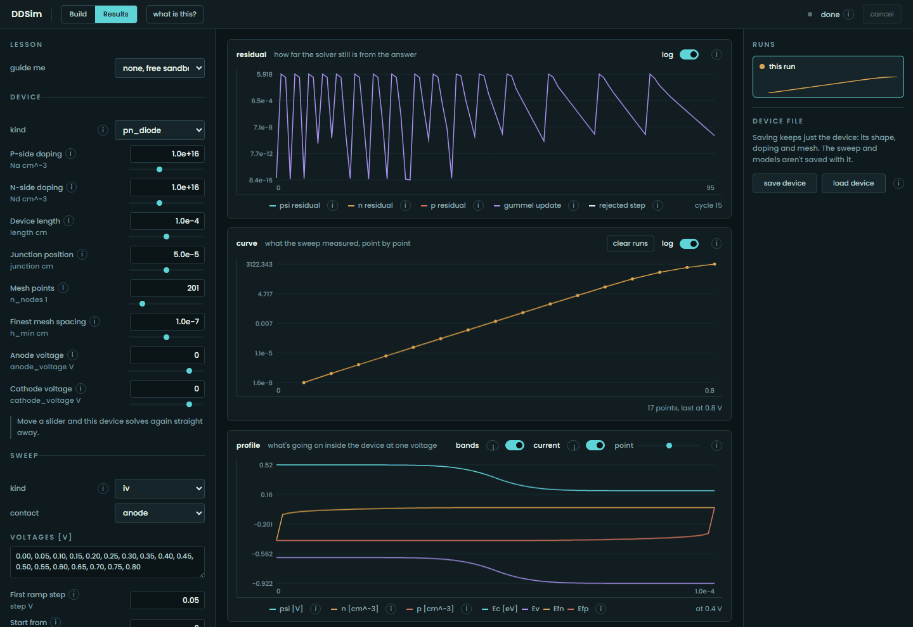
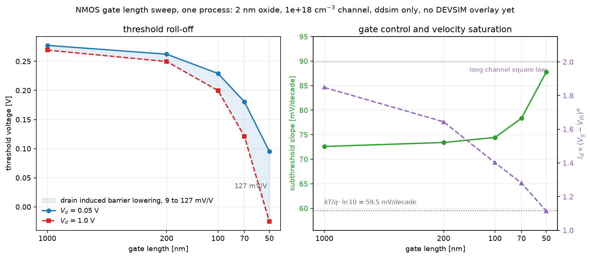
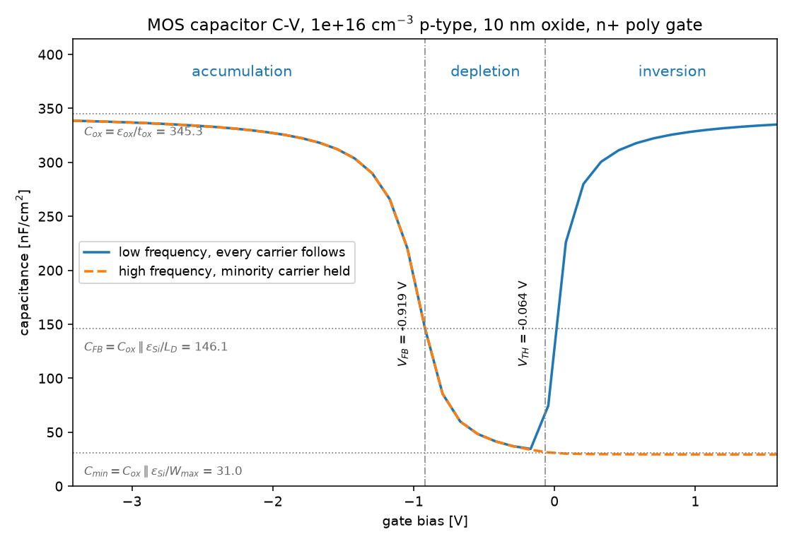
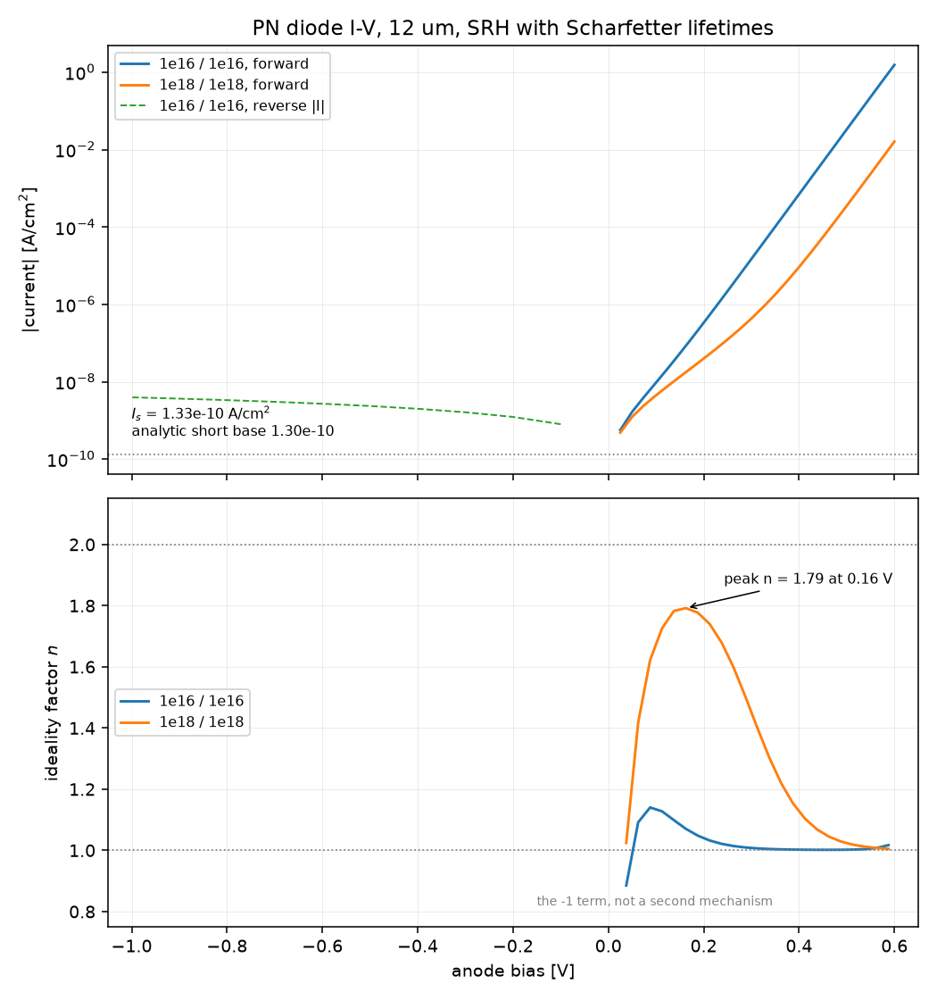
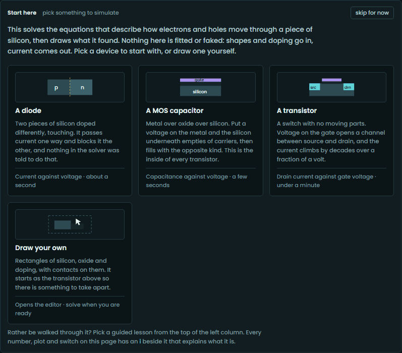
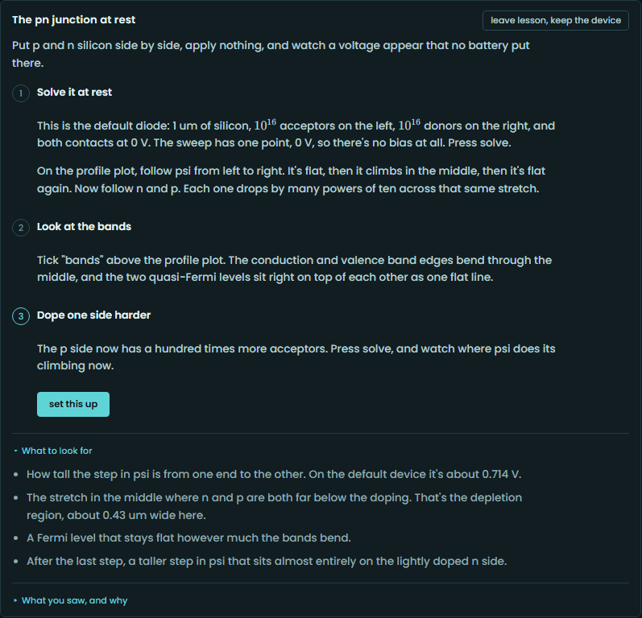
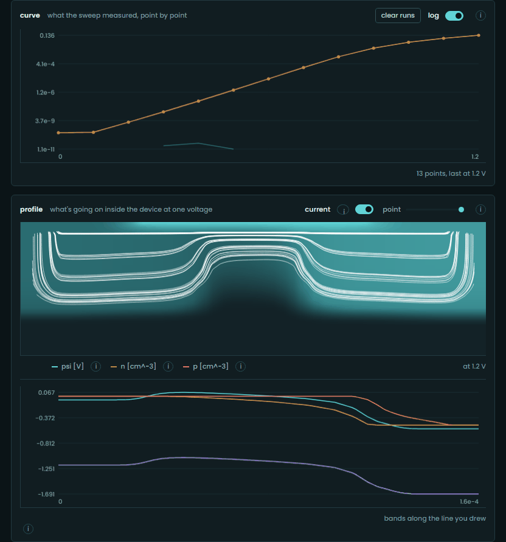
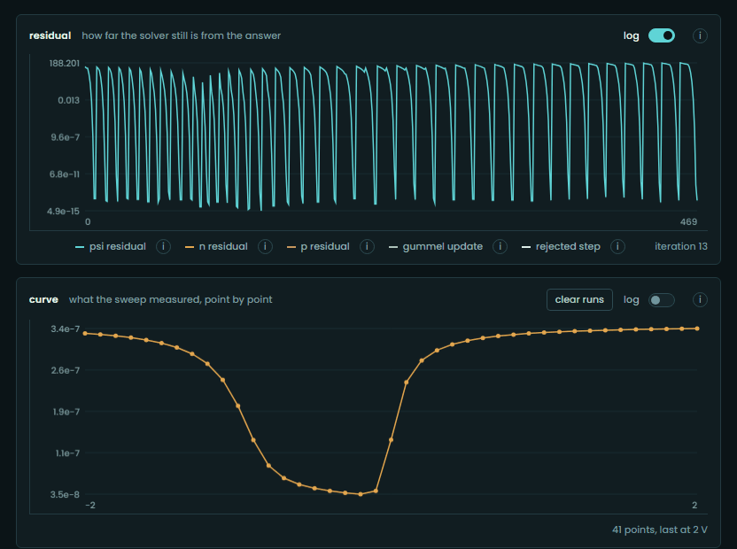
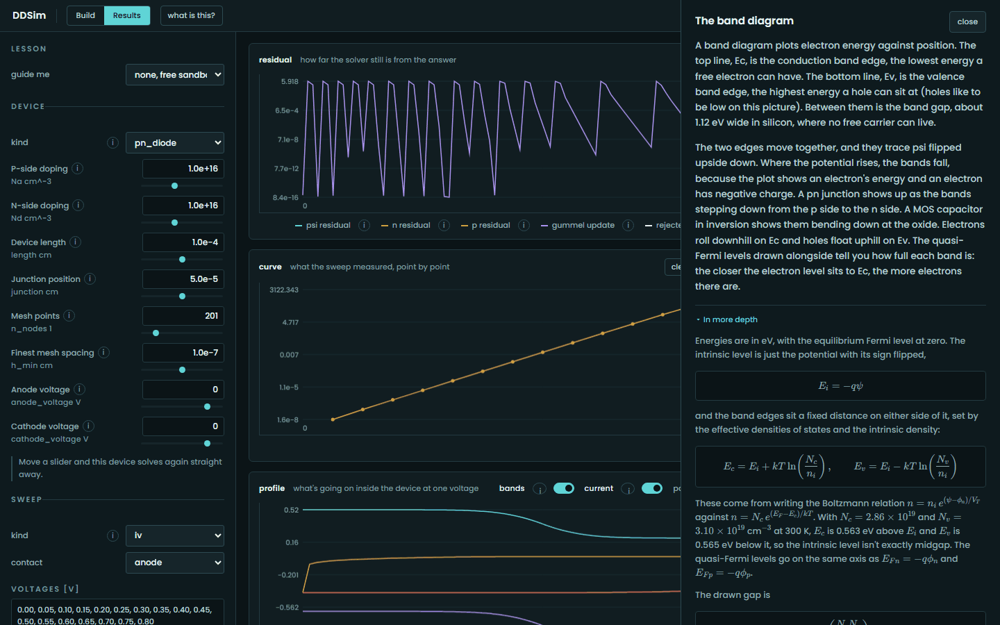
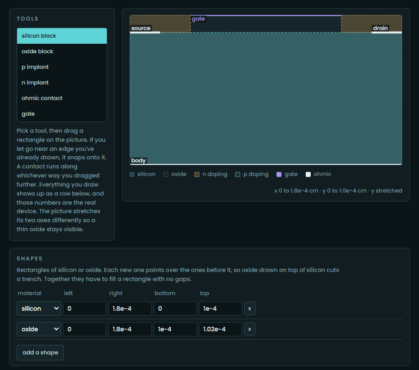

# DDSim

I built a working semi-conductor device simulator completely from scratch. It has been benchmarked against the famous and public DEVSIM. It solves the drift diffusion equations in order to get the corressponding IV and CV curves

  

## What it does

This project is based on poisson’s equation along with electron and hole continuity equations (from the van roosbroeck system) in 1D and 2D. 

It can simulate devices such as PN diodes, MOS capacitors, NMOS transistors, and custom 2D devices.

  

  

  

## Web app

The browser front end runs the real solver on the server and streams progress
back over a web socket, so you watch the residual fall and the curve draw point by point.

  
  

You can see where the current flows and draw a cutline through the device, or
sweep a MOS capacitor's C-V.

  
  

Every knob has an explainer. Each one starts with a plain
explanation, then goes into the equations and points to the docs it came from.

  

You can also draw your own device out of silicon, oxide, implants and
contacts, then solve it as you wish.

  

## License

CC BY-NC 4.0. You're free to use, share and adapt it for non-commercial work as
long as you credit me. See [LICENSE](LICENSE).
